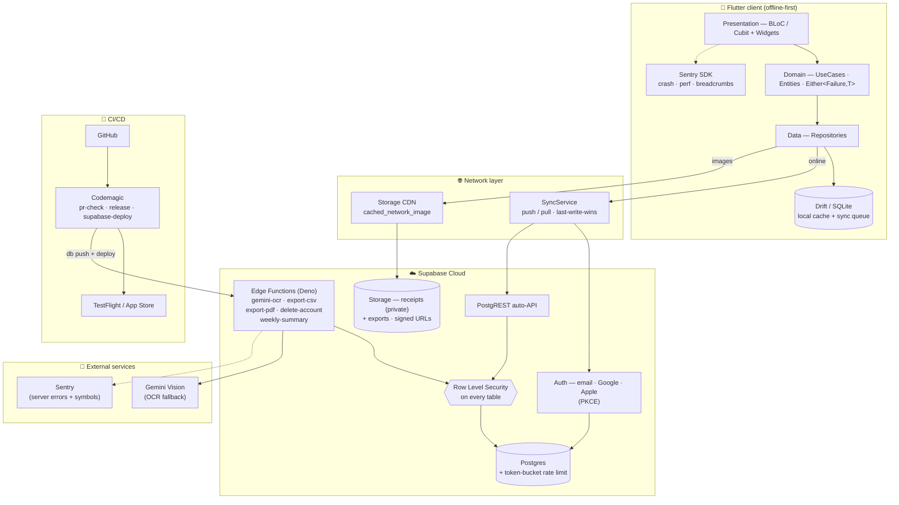
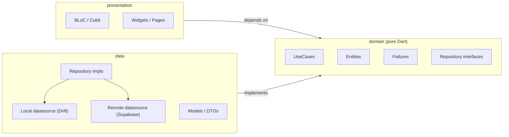
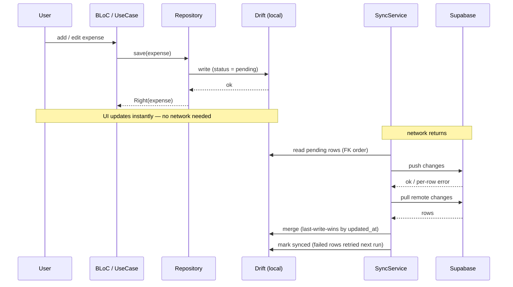

# SmartSpend

> An AI-powered expense tracker that turns a photo of a receipt into
> categorized, budget-aware spending data — and keeps working even with no
> signal.

SmartSpend is a Flutter app built as an end-to-end portfolio project: not a
"frontend + backend" demo, but a deliberate exercise in shipping every
production layer a real app needs — offline-first data, on-device ML, secure
multi-tenant backend, observability, and CI/CD.

---

## What it does

Most expense trackers make you type. SmartSpend lets you **point your camera at
a receipt** and does the rest:

1. **Capture** — snap or pick a receipt photo.
2. **Read** — Google ML Kit extracts the text on-device (free, private, no
   round-trip). A Gemini Vision fallback handles the hard receipts.
3. **Parse** — a dedicated parser pulls out the store name, date, line items,
   and total, with a confidence score.
4. **Categorize** — a hybrid engine (your own past corrections → keyword rules
   → a TensorFlow Lite model) labels each expense automatically and *learns*
   from every correction you make.
5. **Understand** — the dashboard turns it into trends, category breakdowns,
   and plain-language insights ("you spent 40% more on groceries this week").
6. **Stay on budget** — set weekly/monthly caps per category and get nudged
   before you blow past them.

It also archives receipts for **warranty reminders**, splits restaurant bills
between friends, and exports your data as CSV — all in **Turkish, English, and
German**.

The whole app is **offline-first**: every feature works on a plane or in a
basement. When the network comes back, your data syncs to the cloud in the
background, so switching phones never loses a thing.

---

## Why it's built this way

> Vibe coders say "Frontend + Backend." Production reality is 13 layers.

This project treats every one of those layers as a first-class concern, each
with a clear owner in the codebase or infrastructure:

| Layer | Owner in SmartSpend |
|---|---|
| Frontend | Flutter — Clean Architecture + BLoC |
| APIs & backend logic | Supabase Edge Functions (Deno) + PostgREST |
| Database & storage | Supabase Postgres + Storage (S3-compatible) |
| Auth & permissions | Supabase Auth (email + Google + Apple) + RLS |
| Hosting & deployment | Supabase Cloud + Codemagic |
| Cloud & compute | Edge Functions + Postgres functions |
| CI/CD | GitHub + Codemagic |
| Security & RLS | Row Level Security on **every** table, no exceptions |
| Rate limiting | Postgres token-bucket (guards the paid Gemini call) |
| Caching & CDN | Storage CDN + Drift local cache + `cached_network_image` |
| Scaling | Supabase managed |
| Error tracking & logs | Sentry (client) + Supabase logs + structured logger |
| Availability & recovery | Daily backups + offline-first client + sync queue |

The same picture, as a request flowing through the stack:



The goal isn't to over-engineer — it's to demonstrate *awareness* of what a
real product has to handle, and to make each trade-off on purpose.

---

## Key features

- **Receipt scanning** — on-device OCR with a cloud fallback, image
  pre-processing, and editable parse results before saving.
- **Smart categorization** — hybrid keyword + TFLite engine that adapts to your
  personal corrections per store.
- **Manual entry** — fast add-expense form with tags, notes, and recurring
  expenses.
- **Dashboard** — charts, period comparisons, and generated insights.
- **Budgets** — per-category or general caps, threshold alerts, and progress
  rings.
- **Receipt archive** — searchable history with **warranty-expiry reminders**.
- **Bill splitting** — divide a receipt among participants and share the result.
- **Settings** — currency, locale (TR/EN/DE), dark mode, notifications, CSV
  export.
- **Offline-first everything** — reads and writes never block on the network.

---

## Screenshots

> Screenshots are added under [`assets/screenshots/`](assets/screenshots/)
> (see the [capture guide](assets/screenshots/README.md)). Placeholders below
> resolve once the PNGs land.

| Scan | Parse result | Dashboard |
|---|---|---|
|  |  |  |

| Expenses | Budgets | Receipt archive |
|---|---|---|
|  |  |  |

---

## Architecture

SmartSpend follows **Clean Architecture** with feature-based modules.
Dependencies flow inward only:



Dependencies point **inward only**: `presentation → domain ← data`. The
presentation layer never imports `data`; both outer layers depend on the pure
`domain`.

- **Presentation** never imports the data layer — it talks to the domain.
- **Domain** is pure Dart: zero Flutter, Drift, or Supabase types. Every
  fallible operation returns `Either<Failure, T>` (via `dartz`), so errors are
  values, not exceptions.
- **Data** implements the domain's repository interfaces over two sources:
  Drift (local SQLite) and Supabase (remote).

Conventions worth knowing:

- **Money is integers** in minor units (kuruş / cents) — never floating point.
- **Timestamps are UTC** in storage, localized only for display.
- One feature = one BLoC; business logic lives in use cases, never in widgets.

### Offline-first sync

Reads always come from Drift, so the UI is instant and works offline. Writes
land in Drift first with a `pending_*` status. A background `SyncService` then:

- **pushes** local changes in foreign-key order (parents before children),
- **pulls** remote changes and resolves divergence **last-write-wins** by
  `updated_at`,
- **isolates per-row failures** — a single bad row is logged and retried next
  run instead of aborting the whole batch.

A write while offline, then reconnecting:



### Security

Every Postgres table has Row Level Security enabled with owner-only policies —
a user can only ever see their own rows. The paid Gemini OCR call is gated by a
server-side token bucket, the receipts bucket is private (signed URLs only),
and secrets never ship in source or reach the client.

---

## Tech stack

| Concern | Choice |
|---|---|
| Framework | Flutter 3.x + Dart 3.x |
| State management | BLoC + Cubit |
| Local database | Drift (SQLite) |
| Backend | Supabase (Postgres, Auth, Storage, Edge Functions) |
| OCR | Google ML Kit (on-device) + Gemini Vision (fallback) |
| On-device ML | TensorFlow Lite |
| Error handling | `dartz` `Either<Failure, T>` |
| DI | `get_it` + `injectable` |
| Routing | `go_router` |
| Observability | Sentry (crash, performance, breadcrumbs) |
| CI/CD | Codemagic |
| i18n | `intl` + ARB (TR / EN / DE) |

**Platforms:** iOS (primary, min 16.0) · Android (secondary, min SDK 24).

---

## Testing

Quality is enforced, not assumed:

- **615 tests** — unit, BLoC (`bloc_test`), repository, widget, and integration,
  all mocked with `mocktail` (never hitting real Supabase).
- **5 integration scenarios** in `integration_test/` exercise the offline-first
  engine end to end: offline-queue drain, sign-out cache wipe, server-pull
  merge, last-write-wins conflict rejection, and isolated push-failure retry.
- **~80% line coverage** (79.3%), measured with generated sources excluded.
- **RLS policies** are tested separately with pgTAP.

```bash
flutter test --coverage
lcov --remove coverage/lcov.info '*.g.dart' '*.freezed.dart' \
  '*/l10n/generated/*' '*/generated/*' -o coverage/lcov.cleaned.info
genhtml coverage/lcov.cleaned.info -o coverage/html
```

---

## Getting started

Secrets are supplied at build time via `--dart-define-from-file=.env`
(Supabase anon key, Sentry DSN, etc.). `.env` is git-ignored — copy the example
and fill in your own keys.

```bash
flutter pub get
dart run build_runner build --delete-conflicting-outputs   # Drift + DI codegen
flutter gen-l10n                                            # localizations
flutter run --dart-define-from-file=.env
```

Generated files (`*.g.dart`, `lib/l10n/generated/`) are **not committed** — run
the codegen commands above after a fresh checkout.

### Quality gates

```bash
flutter analyze --fatal-infos   # must be 0 issues
flutter test                    # must be all green
```

---

## Continuous integration

CI/CD runs on [Codemagic](https://codemagic.io) — see
[`codemagic.yaml`](codemagic.yaml). Three workflows:

| Workflow | Trigger | Does |
|---|---|---|
| `pr-check` | pull request | codegen → `flutter analyze --fatal-infos` → `flutter test --coverage` → coverage gate (≥ 79.0%, target 80%) → `supabase db lint` + pgTAP → unsigned iOS build |
| `release` | `v*` tag push | tests → signed IPA → Sentry dSYM upload → TestFlight |
| `supabase-deploy` | `main` push | `supabase db push` + Edge Function deploy *(enabled only after the first manual deploy)* |

Secrets live in Codemagic environment groups (`supabase`, `sentry`,
`appstore_connect`) and never appear in source. The Flutter binary only ever
receives the anon key and public client IDs via `--dart-define-from-file=.env`;
`service_role` and Gemini keys stay server-side.

---

## Contributing

See [CONTRIBUTING.md](CONTRIBUTING.md) for branch naming, conventional commits,
the codegen/l10n steps, how to run the test suites, and the PR checklist.

---

## Project structure

```
lib/
├── app/          # MaterialApp, router, DI, BlocObserver
├── core/         # database (Drift), error, network, services, theme, utils
└── features/
    ├── auth/         # sign-in, sign-up, OAuth (Google / Apple)
    ├── scan/         # camera + OCR + parser
    ├── expenses/     # list, detail, add/edit
    ├── dashboard/    # charts and insights
    ├── budget/       # caps and alerts
    ├── receipts/     # archive + warranty reminders
    ├── split/        # bill splitting
    ├── settings/     # currency, locale, export
    └── categorization/  # hybrid AI categorizer
supabase/         # migrations, Edge Functions, pgTAP tests, seed
test/             # mirrors lib/
integration_test/ # end-to-end offline-first flows
```

Each feature is a self-contained Clean Architecture slice
(`presentation / domain / data`).

---

## Roadmap

Built over 10 weekly sprints:

| Phase | Sprints | Focus |
|---|---|---|
| Foundation | 1–2 | Data layer, navigation, OCR engine + parser |
| Core | 3–5 | Expenses, AI categorization, dashboard |
| Advanced | 6–7 | Budgets + alerts, bill splitting, receipt archive |
| Backend | 8 | Supabase auth, cloud sync, Edge Functions |
| Quality & launch | 9–10 | Tests, performance, a11y, observability, CI/CD, App Store |

---

## Author

**İsmail Tunç Kankılıç** — built as a portfolio project demonstrating
production-grade, full-stack Flutter engineering.
